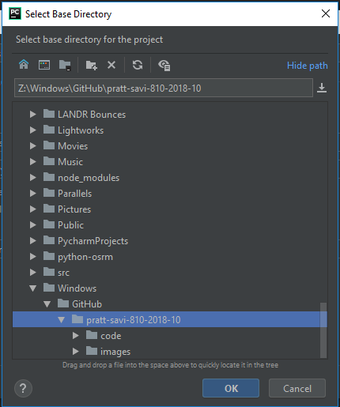
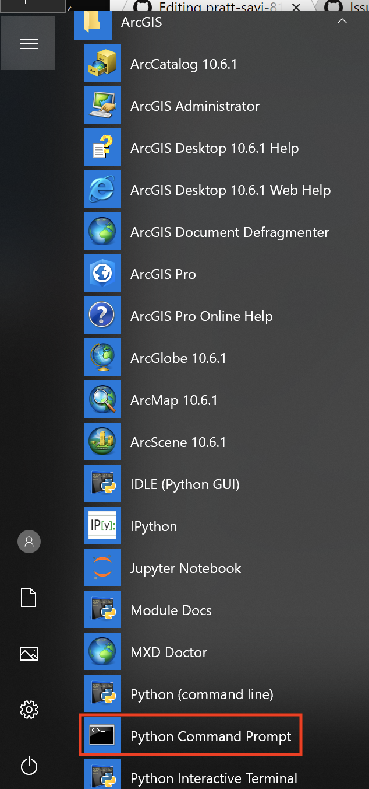
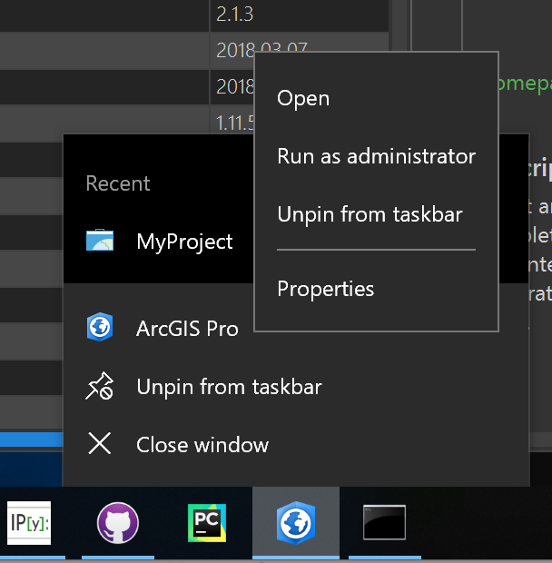

## Assignment 00
# Setting up your Python/ArcGIS Pro Development Environment

In order to get started Python development on your own machine there are a few things that would be great to get started.

### ArcGIS (Pro and Desktop) for `arcpy`

Make sure you have [ArcGIS Desktop](http://desktop.arcgis.com/en/) and [ArcGIS Pro](https://pro.arcgis.com/en/pro-app/) installed. Since we're going to be focused on programming for GIS with `arcpy` for this course it'll be useful to have one or both of them installed. It's **not** entirely necessary or **required for coding at home** as you'll also be able to **write code** and **[pseudocode](https://en.wikipedia.org/wiki/Pseudocode)** without the software installed. You'll even be able to edit your code with a Mac or Linux. If you're interested in [ArcGIS for Personal/Home use](https://www.esri.com/en-us/store/arcgis-personal-use) it costs about $100. To run on a Mac, I use [Parallels](https://www.parallels.com/) for Windows virtualization. 

## Setting up PyCharm

