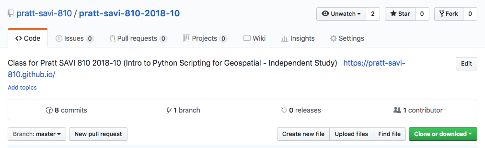
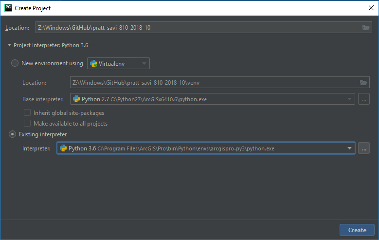
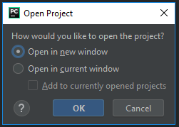
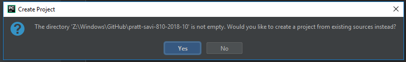
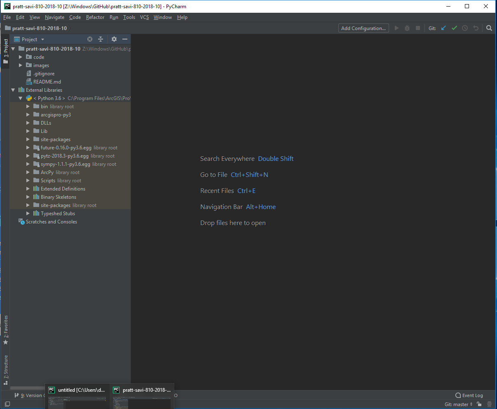

## Assignment 00
# Setting up your Python/ArcGIS Development Environment

In order to get started Python development on your own machine there are a few things that would be great to get started.

For the purposes of this course we will be using;
* ArcGIS Pro
* ArcGIS Desktop
* GitHub Desktop
* PyCharm (community edition - free)
* Atom (optional)
* Git.exe (optional)

## ArcGIS (Pro and Desktop) for `arcpy`

Make sure you have [ArcGIS Desktop](http://desktop.arcgis.com/en/) and [ArcGIS Pro](https://pro.arcgis.com/en/pro-app/) installed. Since we're going to be focused on programming for GIS with `arcpy` for this course it'll be useful to have one or both of them installed. It's **not** entirely necessary or **required for coding at home** as you'll also be able to **write code** and **[pseudocode](https://en.wikipedia.org/wiki/Pseudocode)** without the ArcGIS software installed. You'll even be able to edit your code with a Mac or Linux. If you're interested in [ArcGIS for Personal/Home use](https://www.esri.com/en-us/store/arcgis-personal-use) it costs about $100. To run on my Mac, I use [Parallels](https://www.parallels.com/) for Windows virtualization.

*I do not endorse nor receive any financial incentives from suggesting any of the mentioned software. And more often than not, wholly endorse [Open Source Software](https://opensource.com/resources/what-open-source). However, for the purposes of this course and due to the overwhelming popularity and ubiquity of the ArcGIS platform, we are using it to get the most out of Python for GIS to get started programming.*

## GitHub for Desktop

Graciously stolen from [GitHub article on Wikipedia](https://en.wikipedia.org/wiki/PyCharm);

> GitHub Inc. is a web-based hosting service for version control using Git. It is mostly used for computer code. It offers all of the distributed version control and source code management (SCM) functionality of Git as well as adding its own features. It provides access control and several collaboration features such as bug tracking, feature requests, task management, and wikis for every project.[3] (https://en.wikipedia.org/wiki/PyCharm)

### Installing GitHub
* [Download GitHub Desktop](https://desktop.github.com/) and install.

* If you've never used GitHub, try out [GitHub's Hello World Guide](https://guides.github.com/activities/hello-world/).

  > * You’ll learn how to:
    * Create and use a repository
    * Start and manage a new branch
    * Make changes to a file and push them to GitHub as commits
    * Open and merge a pull request

* Try to clone this repo: https://github.com/pratt-savi-810/pratt-savi-810-2018-10
  * HINT - its the BRIGHT GREEN button.

* **IMPORTANT NOTE:** We'll go over GitHub Desktop a bit more in class. So don't worry if you don't quite get it early on.

* **IMPORTANT NOTE:** If you don't have ArcGIS at your home desktop or laptop computer, you can still install GitHub to be able to **write code** and **[pseudocode](https://en.wikipedia.org/wiki/Pseudocode)** without the ArcGIS software installed.

## PyCharm

Graciously lifted from [PyCharm article on Wikipedia](https://en.wikipedia.org/wiki/PyCharm);

>PyCharm is an integrated development environment (IDE) used in computer programming, specifically for the Python language. It is developed by the Czech company JetBrains.[2] It provides code analysis, a graphical debugger, an integrated unit tester, integration with version control systems (VCSes), and supports web development with Django.

>PyCharm is cross-platform, with Windows, macOS and Linux versions. The Community Edition is released under the Apache License,[3] and there is also Professional Edition released under a proprietary license - this has extra features.

>Features
>* Coding assistance and analysis, with code completion, syntax and error highlighting, linter integration, and quick fixes
>* Project and code navigation: specialized project views, file structure views and quick jumping between files, classes, methods and usages
>* Python refactoring: including rename, extract method, introduce variable, introduce constant, pull up, push down and others
>* Support for web frameworks: Django, web2py and Flask
>* Integrated Python debugger
>* Integrated unit testing, with line-by-line code coverage
>* Google App Engine Python development
>* Version control integration: unified user interface for Mercurial, Git, Subversion, Perforce and CVS with changelists and merge (https://en.wikipedia.org/wiki/PyCharm)

### Setting up PyCharm
* [Download the Community version of PyCharm](https://www.jetbrains.com/pycharm/download) and install.

* **Create a Project** for fun. Name it anything you'd like or create one with the **pratt-savi-810-2018-10** repo.

* Try pointing to the ArcGIS Desktop or ArcGIS Pro `python.exe` - don't worry if you can't find it, point to any python if you have Python installed. If you don't, let me know and we'll get a version of Python installed on your machine.

* Open in a "new window" - this will just add a new window to work with.  

* If you already have some files in there, such as our class directory, select `Yes` 

* Now we have an open PyCharm Project. 

<!--  -->

* **IMPORTANT NOTE:** We'll go over PyCharm a bit more in class. So don't worry if you don't quite get it early on.

* **IMPORTANT NOTE:** If you don't have ArcGIS at your home desktop or laptop computer, you can still install PyCharm to be able to **write code** and **[pseudocode](https://en.wikipedia.org/wiki/Pseudocode)** without the ArcGIS software installed.

## Atom (optional)

Atom's Wikipedia link: https://en.wikipedia.org/wiki/Atom_(text_editor), where this text was copied from;

>Atom is a free and open-source[5][6] text and source code editor for macOS, Linux, and Microsoft Windows[7] with support for plug-ins written in Node.js, and embedded Git Control, developed by GitHub. Atom is a desktop application built using web technologies.[8] Most of the extending packages have free software licenses and are community-built and maintained.[9] Atom is based on Electron (formerly known as Atom Shell),[10] a framework that enables cross-platform desktop applications using Chromium and Node.js.[11][12] It is written in CoffeeScript and Less.[13] It can also be used as an integrated development environment (IDE).[14][15][16][17] Atom was released from beta, as version 1.0, on 25 June 2015.[18] Its developers call it a "hackable text editor for the 21st Century".[19] (https://en.wikipedia.org/wiki/Atom_(text_editor))

## Installing Atom (optional)
* [Download and install Atom](https://atom.io/)

* **IMPORTANT NOTE:** If you don't have ArcGIS at your home desktop or laptop computer, you can still install Atom to be able to **write code** and **[pseudocode](https://en.wikipedia.org/wiki/Pseudocode)** without the ArcGIS software installed.

## Git.exe (optional)

Foolishly copied from [Git on Wikipedia](https://en.wikipedia.org/wiki/Git);

>Git (/ɡɪt/[7]) is a version control system for tracking changes in computer files and coordinating work on those files among multiple people. It is primarily used for source code management in software development,[8] but it can be used to keep track of changes in any set of files. As a distributed revision control system, it is aimed at speed,[9] data integrity,[10] and support for distributed, non-linear workflows.[11]

>Git was created by Linus Torvalds in 2005 for development of the Linux kernel, with other kernel developers contributing to its initial development.[12] Its current maintainer since 2005 is Junio Hamano.

>As with most other distributed version control systems, and unlike most client–server systems, every Git directory on every computer is a full-fledged repository with complete history and full version tracking abilities, independent of network access or a central server.[13]

>Git is free and open source software distributed under the terms of the GNU General Public License version 2. (https://en.wikipedia.org/wiki/Git)

### Installing Git.exe (optional)
* [Download and install Git.exe](https://git-scm.com/downloads)

* PyCharm will ask you to point to it, you might find it here:
  *     C:\Program Files\Git\bin
